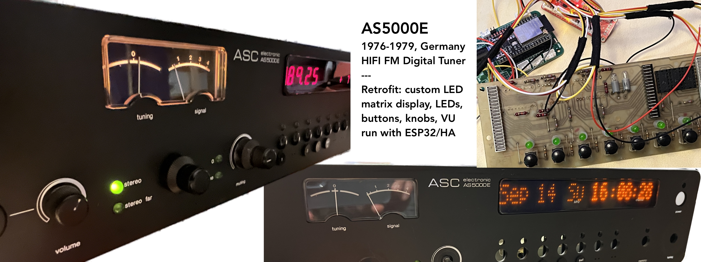

# Radio Retrofit 

## ASC AS-5000 Tuner as Internet Streamer

The AS-5000E tuner from the late 1970s was an early digital tuner which featured programmable presets and a modular design. This project is a retrofit which replaces the internal electronics with an ESP32 and music streaming server, retaining the original controls and design. Check out the [vintage product sheet](https://asc6000.de/downloads/asc-hifi/asc-prospekt_as5000e_5000v_1977.pdf).

The display was originally a 7-segment frequency display, replaced with [RetroText](https://github.com/PixelTheater/retrotext) to form a custom 18x char 4x6 LED matrix. The buttons and LEDs are controlled with the [Lights n' Buttons](https://github.com/PixelTheater/lights-and-buttons) PCB, which features the IS37FL3737 LED driver for the matrix, and the TCA8418 keypad controller. There's a single big tuner knob which has been re-wired to a pushbutton rotary encoder. This will be used to change the station or preset, or navigate menus and playlists.

## Overview of Firmware

This firmware interfaces with the controls and defines some basic modes and behaviors.

- Startup: scans and tests the required components, initializes the drivers and starting state, with status and animation displayed.
- Defines modes: select presets with buttons and switches, while manages state, timeouts, visual feedback and what mode the user is in.
- Playlist access: allows user to scroll through more detailed playlist, and provides configuration and navigation options
- Source mode: switch between internet radio, local media files, spotify, etc. This interfaces with modules that manage the actual playback and audio output, and provide status feedback and control.

The functions will be exposed as a library which can be used inside of an ESPHome project, via external components.

## Hardware and Controls

- Display: 3x RetroText modules, each with 6 characters, for a total of 18 4x6 pixel characters. The I2C addresses are 0x50, 0x51, and 0x52 (GND, VCC, and SDA).
- Keypad: 4x6 matrix of buttons, controlled by the TCA8418 keypad controller. The I2C address is 0x53 (SCL).
- Rotary Encoder with push button, controlled with the TCA.
- Status LED: built-in LED on the ESP32, used to indicate status.
- Power Supply: 5V from external supply.

## Project Progress

First version: prototype, combining the existing [RetroText](https://github.com/PixelTheater/retrotext) and [Lights n' Buttons](https://github.com/PixelTheater/lights-and-buttons) projects.

Once that's working, here are planned features:

- Create basic state and event handling to deal with button presses and mode changes, using the display to show the current mode
- Add support for handling the preset buttons, which have different behaviors depending on the mode
- Abstracted playlist functionality, which allows the user to scroll through a list of presets and select one
- Create a basic API for the ESPHome project to use, exposing the UI and events to allow media playback selection, volume controls, etc.

