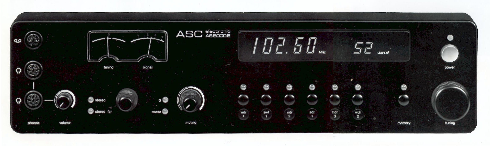

# AS-5000E Front Panel Controls

*The original front panel layout, this is the original design - this project replaces the mains screen with an led character matrix display.*

## Physical Layout

**Display**: 18-character dot-matrix display (3× RetroText modules, 6 chars each)
- 4×6 pixel glyphs, individually addressable with PWM
- Driven by 3× IS31FL3737 LED drivers

**Input Controls**:
- **Rotary Encoder**: Main knob ("Tuning") with push button (station/menu navigation)
- **Preset Buttons**: 7 preset buttons + 1 memory button (8 total)
- **Potentiometer**:  Muting/brightness control knob (originally "Volume")
- **Mode Selector**: 4-position switch (Stereo, Stereo-Far, Q, Mono)

**Indicators**:
- **Preset LEDs**: 8 LEDs above preset buttons
- **Mode LEDs**: 4 LEDs for mode selector
- **VU Meters**: 2 analog meters (Tuning and Signal) with 5 LED channels total

**Audio**: 2× headphone jacks, cassette DIN socket (not wired)

## Hardware Connections

All pin assignments defined in `include/hardware/HardwareConfig.h`.

### I2C Devices

| Device | Address | ADDR Pin | Purpose |
|--------|---------|----------|---------|
| TCA8418 Keypad Controller | 0x34 | - | Button/encoder scanning (4×10 matrix) |
| IS31FL3737 Display #1 | 0x50 | GND | RetroText module 1 |
| IS31FL3737 Display #2 | 0x5A | VCC | RetroText module 2 |
| IS31FL3737 Display #3 | 0x5F | SDA | RetroText module 3 |
| IS31FL3737 Preset LEDs | 0x55 | SCL | Button/mode/VU LEDs (12×12 matrix) |

**IS31FL3737 Address Calculation**: Base `0b1010000` + ADDR pin bits
- GND=`0000` → 0x50, VCC=`1010` → 0x5A, SDA=`1111` → 0x5F, SCL=`0101` → 0x55

### TCA8418 Matrix Mapping (VERIFIED)

**Preset Buttons** (Row 3):
- Preset 1: R3, C3
- Preset 2: R3, C2  
- Preset 3: R3, C1
- Preset 4: R3, C0
- Preset 5: R3, C8
- Preset 6: R3, C7
- Preset 7: R3, C6
- Memory: R3, C5
- Note: Col 4 physically skipped (PCB gap)
- Note: Ghost key releases detected on adjacent columns (TCA8418 scanning artifact)

**Rotary Encoder** (Row 2):
- Channel A: R2, C2
- Channel B: R2, C3  
- Push Button: R2, C1

**Mode Selector** (Row 0):
- M0 (Stereo): R0, C5
- M1 (Stereo-Far): R0, C6
- M2 (Q): R0, C7
- M3 (Mono): R0, C8

### Analog Input

**Potentiometer**: GPIO33 (ADC1_CH5)
- 12-bit ADC (0-3.3V), reads speaker volume control
- Filtered with sliding window average and 2% deadzone
- Updates Home Assistant media player volume in real-time

### LED Matrix Mapping (IS31FL3737 @ 0x55)

**Preset LEDs** (Row 3): SW3/CS(3,2,1,0,8,7,6,5)

**Mode LEDs** (Row 0): SW0/CS(7,6,8,5)

**VU Meter LEDs** (Row 2):
- VU Meter 1: SW2/CS1
- VU Meter 2: SW2/CS2  
- VU Meter 3: SW2/CS3
- Note: One meter is bipolar and requires both CS2/CS3 to function

## Volume Control

**Potentiometer** controls speaker volume:
- Reads 0-3.3V and converts to 0-100% volume
- Calls Home Assistant `media_player.volume_set` service
- Volume target is configured via `input_select.radio_media_player_entity` helper
- Filtered to prevent jitter and excessive updates

**Display Brightness** is controlled separately via ESPHome:
- Exposed as `Display Brightness` number entity in Home Assistant
- Range: 10-255 (slider control)
- Clock mode uses reduced brightness (100) automatically
